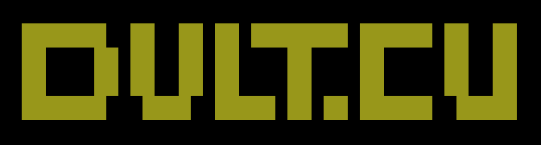
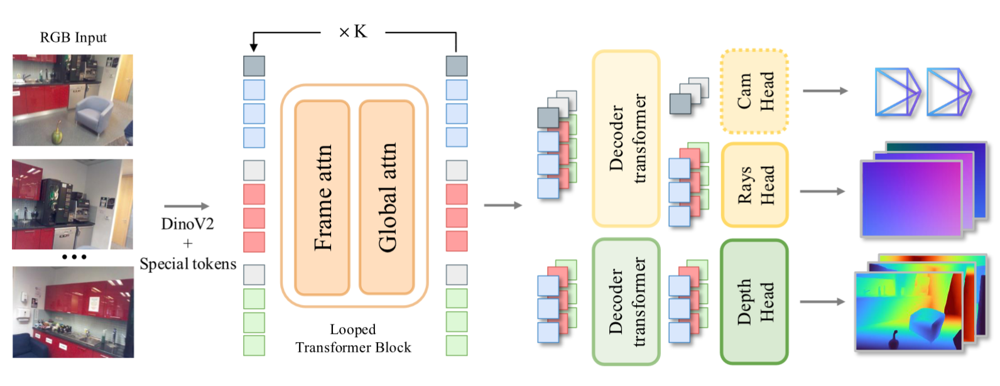
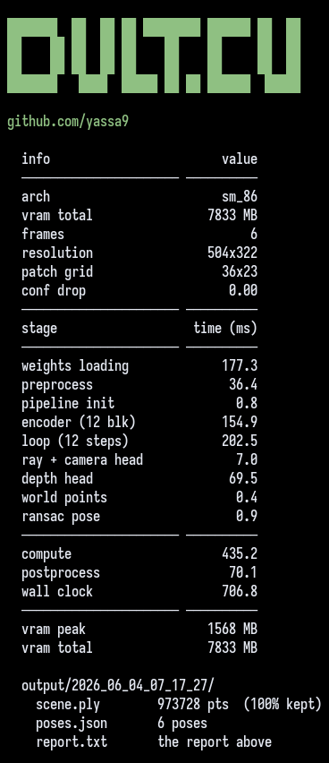

# dvlt.cu

<p align="center">
  
</p>

```text
If you wish to make an apple pie from scratch, 
you must first invent the universe.
- Carl Sagan
```

https://github.com/user-attachments/assets/9382ed6d-7143-4559-97c6-e2188ed56318


`dvlt.cu` is a suckless, single binary, zero-dependency inference engine for NVIDIA's [DVLT](https://research.nvidia.com/labs/dvl/projects/dvlt/) (Déjà View Looping Transformer), written in pure CUDA/C++, no python, no torch, no framework. It reconstructs 3D from a handful of images (depth + rays + camera pose => point cloud) and runs on consumer GPUs. Under the hood: mmap'd bf16 weights, a single bulk GPU upload, a one shot bump arena, and fused kernels on cuBLASLt + cuTLASS attention.

I've long been into 3D reconstruction from photogrammetry, NeRFs, and 3D gaussian splatting, and was struck first by [VGGT](https://vgg-t.github.io/) and then by [pi3](https://yyfz.github.io/pi3/). So I decided to fuse my love for CUDA & CUTLASS with my love for 3D, and port a feedforward 3D transformer to pure CUDA C++, with no python, no torch, no framework, no dependencies. I was already deep into porting [pi3](https://yyfz.github.io/pi3/) when NVIDIA published [dvlt](https://research.nvidia.com/labs/dvl/projects/dvlt/), gave it a try, and was so impressed by how few parameters it needed that I shifted course and committed to porting dvlt end to end.

---

## What does it do ? 

`dvlt.cu` takes a folder of images (or a video) of a static scene and reconstructs it in 3D in a single forward pass, so no per scene training like NeRF or gaussian splatting, writing a merged point cloud (`scene.ply`) and the recovered per view camera poses (`poses.json`).

- All CUDA C/C++
  + No pyhton, No torch, No TF, No Triton, No Huggingface
  + No vllm, No llama.cpp, No ONNX
- Nearly no dependencies: 
  + cuBLASLt (shipped with libcuda)
  + header-only cuTLASS 
  + header-only stb_image
- `bf16` transformer path + `fp32` for the precision-sensitive output heads
- tight memory pipeline: 
  + mmap'd weights 
  + one bulk GPU upload
  + a single bump arena
- static `constexpr` dims for compile time optimization; only resolution-derived dims are runtime
- fused kernels everywhere
  + gelu+bias, 
  + layerscale+bias+residual, 
  + split+qknorm+rope, 
  + groupnorm+bias+relu, 
  + convT-as-gemm

---

It's NVIDIA's `nvidia/dvlt` model, faithfully reimplemented; for the model itself (the looping transformer, the heads, the math) read the [DVLT paper](https://arxiv.org/pdf/2605.30215).

<p align="center">
  
  <br>
  <em>DVLT architecture; figure 2 from the <a href="https://arxiv.org/pdf/2605.30215">DVLT</a> paper</em>
</p>

---

## QUICK START

Just clone and run the setup script:

```bash
git clone https://github.com/yassa9/dvlt.cu
cd dvlt.cu
./setup.sh
```

`setup.sh` does it all: 
- sparse-clones the [cutlass](https://github.com/NVIDIA/cutlass) headers it needs
- downloads the [nvidia/dvlt](https://huggingface.co/nvidia/dvlt) checkpoint from Hugging Face
- converts it to the bf16 blob (model/weights.dvlt)
- builds `./build/dvlt`

you can try on that tiny set comes with the repo ( downloaded from [agisoft](https://www.agisoft.com/downloads/sample-data/) ):

```bash
./build/dvlt -i inputs/shoe
```

<p align="center">
  
  <br>
  <em>Terminal output report</em>
</p>

> [!IMPORTANT]
> The dvlt.cu **code** is mine and Apache-2.0. The **model weights** are NOT mine and are NOT included in this repo. They are released by NVIDIA under the NVIDIA License (non-commercial; research and evaluation use only) and are fetched from NVIDIA directly at setup time. See `NOTICE` and `THIRD_PARTY.md`.

> [!NOTE]
> If the Hugging Face download fails, grab the `model.safetensors` in dvlt.cu/model/ manually from huggingface.co/nvidia/dvlt and rerun ./setup.sh.

> [!TIP]
> If your repo lives on a HDD, the script will tell you to move `weights.dvlt` to an SSD (loading the 253 MB blob is i/o bound) and pass it with `-w`.

### If you want to build from scratch

`setup.sh` already builds it, but if you just want:

```bash
make dvlt
```

You only need:
- `CUDA` + `nvcc`
- `cuBLASLt` (ships with CUDA)
- the `cutlass` headers (fetched by `setup.sh`)

The Makefile auto detects your GPU arch, or pass it explicitly: `make dvlt ARCH=sm_86`.

## USAGE

You can see the arguments manual by:

```bash
./build/dvlt
```

the output is that manual:

```text
usage: ./build/dvlt [options] <directory | img1 img2 [img3 ...]>

options:
  -o, --output <dir>     output directory (default: output/<timestamp>)
  -w, --weights <path>   weights file     (default: model/weights.dvlt)
  -c, --conf <0-1>       drop the lowest-confidence fraction of points (default: 0)
  -s, --img-size <N>     working resolution (default: 504)
  -i, --input       add an input image (repeatable; input is also positional)
  -b, --no-banner        hide the ascii logo banner
  -h, --help             show this help

outputs:
  <output>/scene.ply     merged point cloud (all views, world space)
  <output>/poses.json    camera poses (extrinsics c2w + intrinsics per view)

examples:
  ./build/dvlt photos/                      all jpg/png in directory
  ./build/dvlt img1.jpg img2.jpg            explicit image list
  ./build/dvlt -o results/ -c 0.5 photos/   custom output + confidence drop
```

> [!TIP]
> O(N²) global attention is the memory/compute wall, so there's a ceiling of roughly `~70` frames on `8GB`. To fit more, lower the working resolution with `-s` (e.g. ./build/dvlt -s 308 -i inputs/video-name).

Each run writes a timestamped `output/<...>/` with `scene.ply`, `poses.json`, and `report.txt` (the printed report).

### From a video

If you have a video instead of images, extract frames first with the included tool:

```bash
./tools/v2f.sh -h

usage: ./tools/v2f.sh -i input.mp4 [-f fps | -n count] [-s] [-o output_dir]
  -i <path>   input video (required)
  -f <fps>    sample at this frame rate (default: 2, matches dvlt)
  -n <int>    instead, extract exactly N uniformly-spaced frames
  -s          pick the sharpest frame per bucket (needs blurdetect)
  -o <dir>    output directory (default: inputs/<video name>/)
then: ./build/dvlt inputs/<video name>/
```

For example:
This samples this video into 30 sharp frames in `inputs/video-name/` dir:
```bash
./tools/v2f.sh -i path/video-name.mp4 -n 30 -s
```

`-s` picks the **sharpest** frame per time bucket (via ffmpeg `blurdetect`), which matters a lot for multiview reconstruction. It writes to `inputs/video-name/`, then:

```bash
./build/dvlt -i inputs/video-name/
```


### Viewing the result

The `.ply` opens in any point cloud viewer (MeshLab, CloudCompare, Blender), but those can't show **where the cameras were**. So there's a tiny built-in viewer that draws the cloud **and** the camera frustums together:

```
# double-click it, any browser
open tools/viewer.html   
chrome tools/viewer.html
firefox tools/viewer.html
```
then drag `scene.ply` **and** `poses.json` onto the page. Orbit to look around; each frustum is one input view. No install, no node/npm, no server, it's one HTML file and a couple of vendored `.js`, all running locally.

---

## Inspiration 

`dvlt.cu` is a from scratch CUDA port of, and inspired by:
- [DVLT - NVIDIA](https://huggingface.co/nvidia/dvlt) (the original model + paper)
- [VGGT - Meta](https://github.com/facebookresearch/vggt)
- [Pi3](https://github.com/yyfz/Pi3) (multi-view 3D lineage)
- [DINOv2 - Meta](https://github.com/facebookresearch/dinov2) (the ViT backbone)
- [qwen600.cu](https://github.com/yassa9/qwen600) (my own sibling project)

--- 

## License + attribution

The `dvlt.cu` **code** is released under the **Apache License, Version 2.0** (see [LICENSE](LICENSE)), matching upstream NVIDIA DVLT.

The **model weights** (the `nvidia/dvlt` checkpoint) are **not** covered by it, are **not** distributed here, and are **not** mine, they're released by NVIDIA under the **NVIDIA License** (non-commercial; research and evaluation use only) and fetched at setup time. Portions of the algorithm are reimplemented from DVLT, which itself adapts code from DINOv2, PyTorch3D, MoGe, MultiNeRF, Depth-Anything-3 and AnyCalib. See [NOTICE](NOTICE) and [THIRD_PARTY.md](THIRD_PARTY.md) for the full attribution map and license texts.
